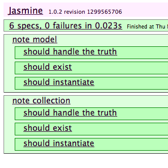
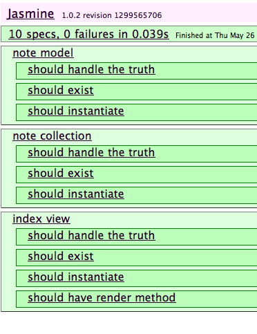

# Tutorial

This is a little tutorial on how to create a single page javascript application using backbone and capt. This isn't a best practise document for using backbone, it's just how the author (@bnolan) uses capt.

## Install capt

Capt is written in javascript, so you need to install node and npm. Then `npm install capt` and you're away.

## Create a new app

In your programming directory:

    capt new notes

Results in:
    
    Capt:
     * Using coffeescript version 1.0.1
     * Creating folders
     * Creating directory structure

And creates this directory structure:

    ./app
    ./app/controllers
    ./app/controllers/application.coffee
    ./app/models
    ./app/views
    ./app/views/jst
    ./config.yml
    ./index.jst
    ./lib
    ./lib/backbone.js
    ./lib/jquery.js
    ./lib/less.js
    ./lib/underscore.js
    ./public
    ./public/stylesheets
    ./spec
    ./spec/controllers
    ./spec/fixtures
    ./spec/index.jst
    ./spec/jasmine
    ./spec/jasmine/jasmine-html.js
    ./spec/jasmine/jasmine.css
    ./spec/jasmine/jasmine.js
    ./spec/models
    ./spec/views

The `app` directory is where all your code specific to this application should go. I tend to put 3rd party libraries in `/lib/` (similair to /vendor/ in a rails app). The `application.coffee` script is the top level of your application, it's responsible for instantiating collections and starting the backbone router.

Capt includes backbone, jquery and underscore out of the box. It also includes less, but this will be removed in the future in favour of compiling your stylesheets in capt, instead of in-browser.

The `/public/` directory contains everything that isn't javascript, coffeescript or fixtures. Note that your application will be served so that the absolute path to your resources is `/public/stylesheets/something.css`, which is a bit ugly.

The `/spec/` directory contains a full spec suite for your application, run using jasmine. Jasmine is a great javascript testing framework (for unit testing anyway), it runs nice and fast and looks good in coffeescript.

`index.jst` is a template that is compiled into your .html file. When running in development mode, your index.html will include all javascript seperately (to make debugging easier), and when you build your project for production, it will include a link to a single compressed javascript file. You should `/index.jst` as you see fit. You probably won't need to edit `/spec/index.jst`, since that's a standard jasmine runner.

## Code generation

Capt has code generation for views, controllers and models. It is worth using these as it will put some stub code into your new class, and create a complimentary spec.

## Create a model

We will create a `note` model and collection:

    capt generate model note
    capt generate collection note

Result:

     * Created app/models/note.coffee
     * Created spec/models/note.coffee
     ...
     * Created app/models/note_collection.coffee
     * Created spec/models/note_collection.coffee

You can access the model in `/app/models`. If you load `/spec/` - you will see the specs run for your new model and collection.

## Creating a controller, view and getting things started

We will create a notes controller and two views, an index view and a new view. This will be a pretty basic application that doesn't do editing or deleting, but you'll get the idea of how things should work.

## Controller

Create the controller:

    capt generate controller notes
    
Then open up `/app/controllers/application.coffee` - it will look a bit like this:

    class Application
      constructor: ->
    
      start: ->
        console.log 'App started'

        # Create your controllers here...
    
        # Then start backbone
        # Backbone.history.start()
    

    @Application = Application

You need to add a line of code to instantiate your notes controller, then start the backbone history router.

    start: ->
      new NotesController
      Backbone.history.start()

While we're here, we'll create a global `Notes` instance of a NoteCollection, which we can use to store all our notes. If you'd rather, you could use `app.notes` and not pollute the global namespace, but for smaller apps, I prefer to be a scope-polluter.

    constructor: ->
      window.Items = new ItemCollection
      
## Create our view

Views are created for a controller so you create a show view on the notes controllers. This isn't perfect, as often times I find I create a controller with only a single view, but it's the convention I work too.

    capt generate view notes index

Generates these files:

    * Created app/views/notes/index.coffee
    * Created app/templates/notes/index.eco
    * Created spec/views/notes/index.coffee
    
This will create a view, template and specs. If you restart your server (ctrl-c then `capt watch` again), capt will pick up the new views and when you re-run the specs you should get even more specs:

If you look in `spec/views/notes/index.coffee` you'll see there is a disabled spec (xit) which renders the view and searches for some content in the rendered view. Once you have some content in your template you should enable this view to ensure your view renders correctly.

## Edit the controller and fire up the app

We want to instantiate a NotesIndexView when we view the notes#index controller - like so:

    class NotesController extends Backbone.Controller
      routes :
        "notes/:id" : "show"
        "notes" : "index"

      index: ->
        view = new NotesIndexView { el : $("body"), collection : Notes }
        view.render()

And now we need to add this to the start of the NotesController spec, so that the specs pass:

    beforeEach ->
      window.Notes = new NoteCollection
  
